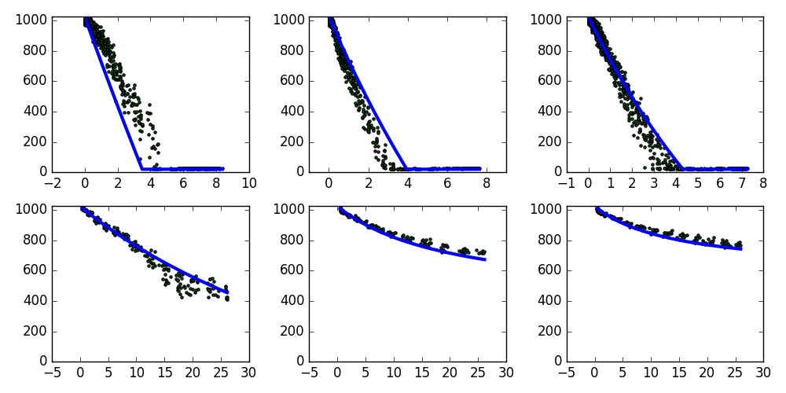

# Tactile sensor calibration report
## Command
```python tactile_calibration.py```
## Model fitting

## Estimated model parameters
Parameter | Value
--- | ---
R<sub>S</sub> | 16.963 k&#937;N
R<sub>0</sub> | 0.502 k&#937;
R<sub>1</sub> | 1.620 k&#937;
R<sub>2</sub> | 2.338 k&#937;

## Resistor selection
Feedback resistor | No Silicone | Thin Silicone | Tick Silicone 
--- | --- | --- | --- 
1 k&#937; | 65.565 N | 1129.508 N | 782.837 N
2.2 k&#937; | 19.482 N | 54.393 N | 1168.148 N
4.7 k&#937; | 7.906 N | 10.690 N | 13.813 N
10 k&#937; | 3.499 N | 3.954 N | 4.315 N
22 k&#937; | 1.547 N | 1.630 N | 1.688 N
47 k&#937; | 0.715 N | 0.733 N | 0.744 N
100 k&#937; | 0.334 N | 0.338 N | 0.341 N

